# WhisprNet
WhisprNet: An Encoder-Decoder based Transformer Model for Automatic Speech Recognition System

## Architecture Overview
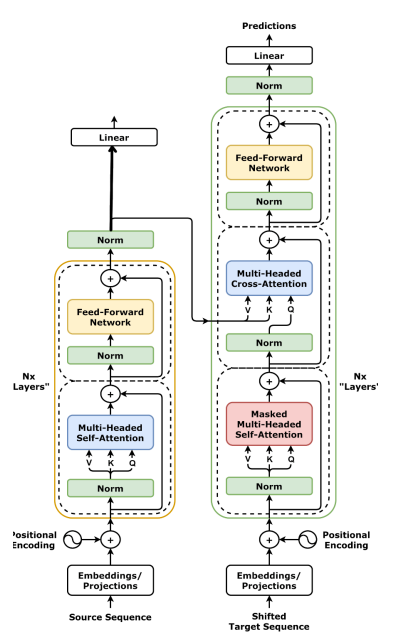

## Inference Results
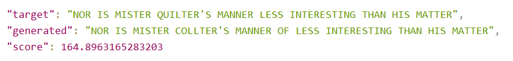
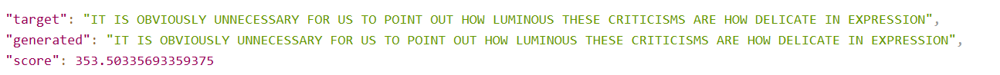
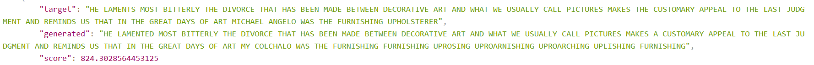
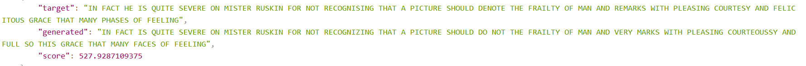
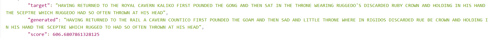

## Attention Weights
### Multi-Head Self Attention Weights
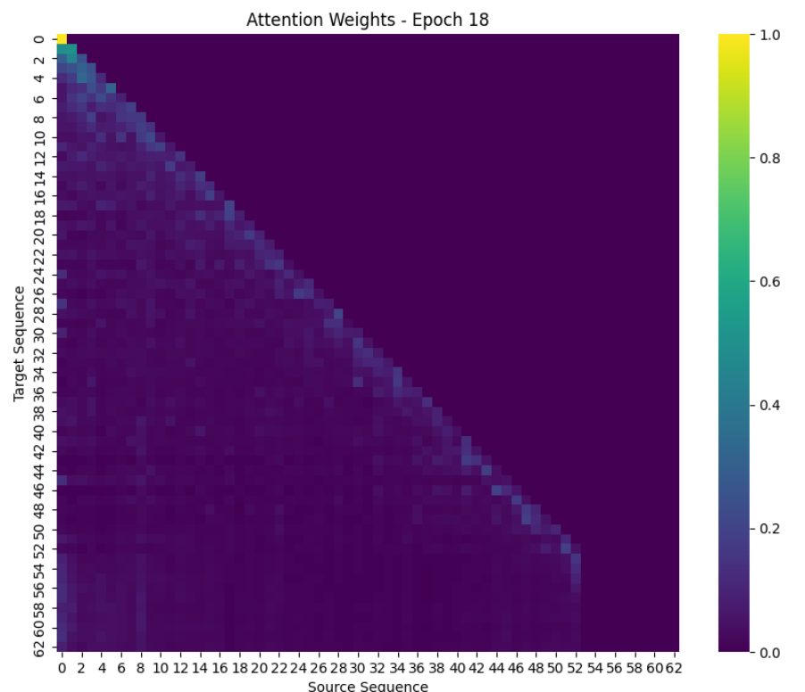

### Multi-Head Cross Attention Weights
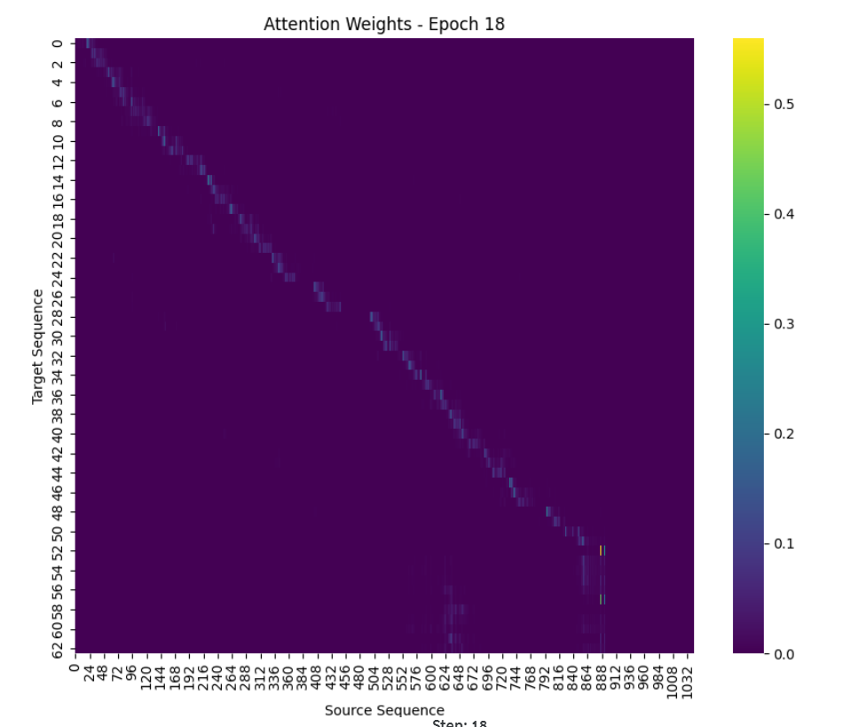

## Metrics
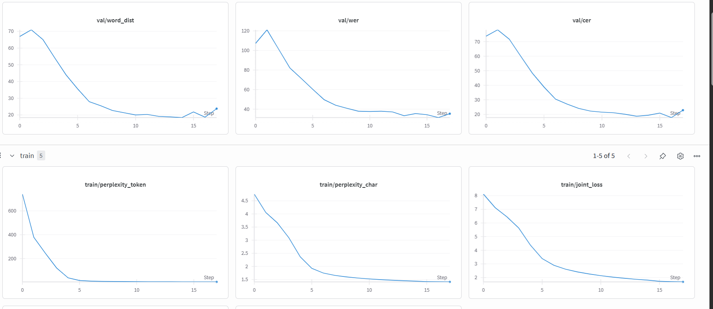
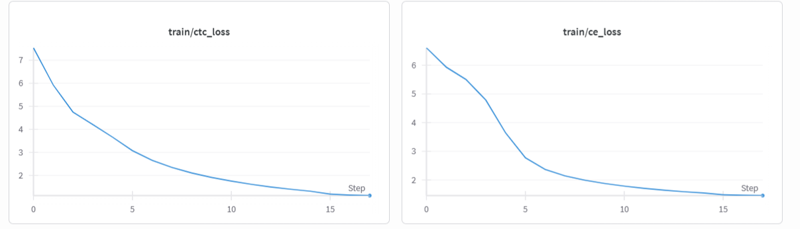
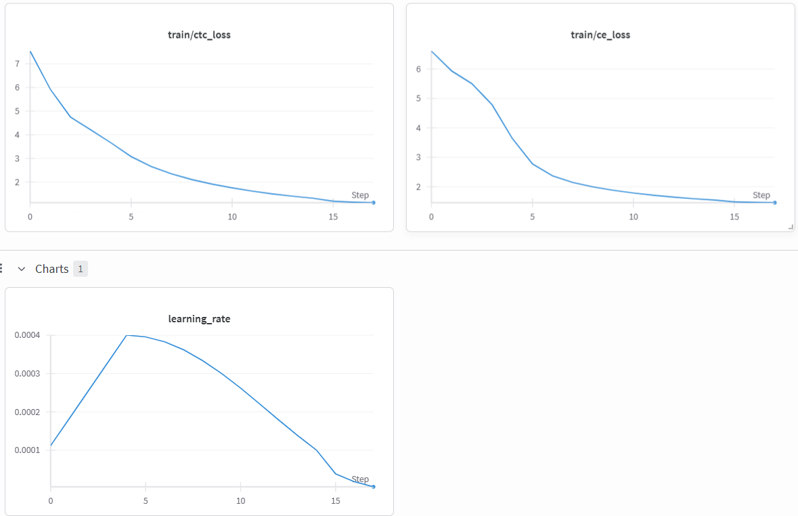

## Model
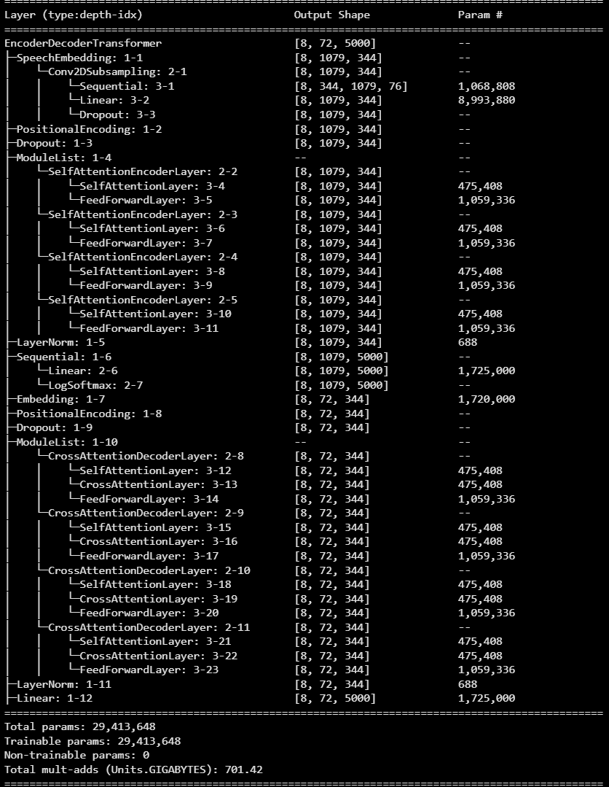

#### Open for any countributions or collaborations to make efficient Machine Learning based Tech solutions.
